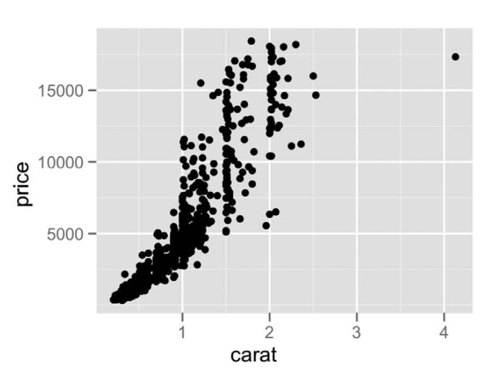
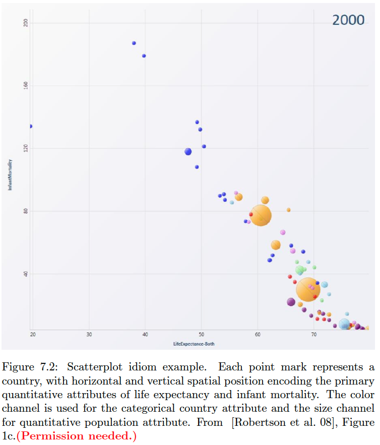

# Idiom-Mark-Data-Encode Table Examples

This page presents several examples of naming the idiom, mark, data attribute, data type, and encoding channel for different types of idioms. I'll ask you to describe your charts using these "idiom/mark/data/encode tables" in HW assignments and on the mid-term exam.

For the information in these tables, we'll use the same terminology as in the tables in Ch 7 (see VAD-Ch7-tables.pdf under the Reading Assignment in Canvas).

## Scatterplot 1

<a href="imgs/fig7.3a.png">Figure 7.3a</a>

Idiom: Scatterplot / Mark: Point
| Data: Attribute | Data: Attribute Type  | Encode: Channel | 
| --- |---| --- |
| carat | value, quantitative | horizontal spatial position (x-axis) |
| price | value, quantitative | vertical spatial position  (y-axis) |

## Scatterplot 2

This example is sometimes called a "bubble chart" because it encodes data with size, so that points look like bubbles.

<a href="imgs/fig7.2.png">Figure 7.2</a>

Idiom: Scatterplot / Mark: Point
| Data: Attribute | Data: Attribute Type  | Encode: Channel | 
| --- |---| --- |
| life expectancy | value, quantitative | horizontal spatial position (x-axis) |
| infant mortality | value, quantitative | vertical spatial position  (y-axis) |
| country | categorical | color hue |
| population | quantitative | size |

## Bar Chart

<a href="https://www.cs.ubc.ca/~tmm/vadbook/eamonn-figs/fig7.4b.pdf">Figure 7.4b</a>

Idiom: Bar Chart / Mark: Line
| Data: Attribute | Data: Attribute Type  | Encode: Channel | 
| --- |---| --- |
| animal type | key, categorical | separate, horizontal position (x-axis) |
| avg weight | value, quantitative | aligned vertical position (y-axis) |

## Line Chart

<a href="https://www.cs.ubc.ca/~tmm/vadbook/eamonn-figs/fig7.8b.pdf">Figure 7.8b</a>

Idiom: Line Chart / Mark: Points with connection marks
| Data: Attribute | Data: Attribute Type  | Encode: Channel | 
| --- |---| --- |
| year| key, ordered | separate, horizontal position (x-axis) |
| cat weight | value, quantitative | aligned vertical position (y-axis) |

## Multiple Line Chart

<a href="https://camo.githubusercontent.com/9c3c2bccb76d7670a269bc622c853b099d75d7c765c8fb3ba3c0acc1d935fd5e/68747470733a2f2f706f6c69637976697a2e636f6d2f77702d636f6e74656e742f75706c6f6164732f323031382f30322f506f6c69637956697a5f57534a5f52656d616b655f4c696e6543686172742d31303234783631332e706e67">PolicyViz.com</a>

Idiom: Multiple Line Chart / Mark: Points with connection marks
| Data: Attribute | Data: Attribute Type  | Encode: Channel | 
| --- |---| --- |
| year| key, ordered | separate, horizontal position (x-axis) |
| percent of families | value, quantitative | aligned vertical position (y-axis) |
| race | categorical | color hue |

## Grouped Bar Chart

<a href="https://www.cs.ubc.ca/~tmm/vadbook/eamonn-figs/fig12.8a.pdf">Figure 12.8a</a>

Idiom: Grouped Bar Chart / Mark: Line
| Data: Attribute | Data: Attribute Type  | Encode: Channel | 
| --- |---| --- |
| state | primary key, categorical | outer horizontal spatial region (x-axis) |
| age group | secondary key, categorial/ordered | inner horizontal spatial region (x-axis) |
| population | value, quantitative | aligned vertical position (y-axis) |
| age group | categorical/ordered | color hue |

## Stacked Bar Chart

<a href="https://camo.githubusercontent.com/e59b8d3539b8984a5f3a97927301c1f517314896b0b2a298fb60c288251d4e1b/68747470733a2f2f706f6c69637976697a2e636f6d2f77702d636f6e74656e742f75706c6f6164732f323031382f30312f4d657272696c6c4c796e63685f474d4c7256366b54653266713872484764626d39457241784c68613748424a733071457a464454305471732e6a7067">PolicyViz.com</a>

Idiom: Stacked Bar Chart / Mark: Line
| Data: Attribute | Data: Attribute Type  | Encode: Channel | 
| --- |---| --- |
| generation | primary key, categorical| horizontal spatial region (x-axis) |
| spending category | secondary key, categorical | vertical region (y-axis)|
| spending percentage | value, quantitative | unaligned inner vertical spatial region (y-axis)  |
| spending category | categorical | color hue |
